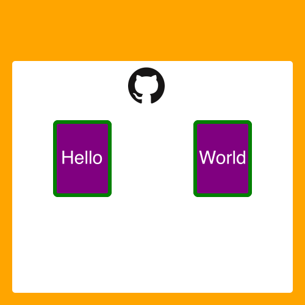

## Early Stage
This project is still in early stage. The goal is to prove the idea of using React components to render in Node canvas. 

## Features

* Support React components (View, Image, Text).
* Support flex layout.
* Support border drawing.

## Simple Example



```tsx
import * as React from "react";
import { writeFileSync } from "fs";
import { Canvas, View, Image, Text } from "../src/components";
import { renderToStream } from "../src/index";

renderToStream(
  <Canvas style={{ width: 500, height: 500, backgroundColor: "orange" }}>
    <View
      style={{
        width: 460,
        height: 380,
        marginTop: 100,
        marginLeft: 20,
        marginRight: 20,
        borderRadius: 5,
        backgroundColor: "white",
      }}
    >
      <Image
        src={__dirname + "/icon.png"}
        style={{
          width: 80,
          height: 80,
          marginLeft: 180,
          backgroundColor: "green",
        }}
      />
      <View
        style={{
          display: "flex",
          alignItems: "center",
          justifyContent: "space-around",
          backgroundColor: "grey",
          flexDirection: "row",
          marginTop: 20
        }}
      >
        <View
          style={{
            backgroundColor: "purple",
            width: 90,
            height: 120,
            borderRadius: 5,
            display: "flex",
            alignItems: "center",
            justifyContent: "center",
            border: '1px solid green'
          }}
        >
          <Text style={{ color: 'white', font: '30px solid' }}>Hello</Text>
        </View>
        <View
          style={{
            backgroundColor: "purple",
            width: 90,
            height: 120,
            borderRadius: 5,
            display: "flex",
            alignItems: "center",
            justifyContent: "center",
          }}
        >
          <Text style={{ color: 'white', font: '30px solid' }}>World</Text>
        </View>
      </View>
    </View>
  </Canvas>
).then((buffer) => {
  writeFileSync(__dirname + "/helloworld.png", buffer);
});

```

## License

MIT
